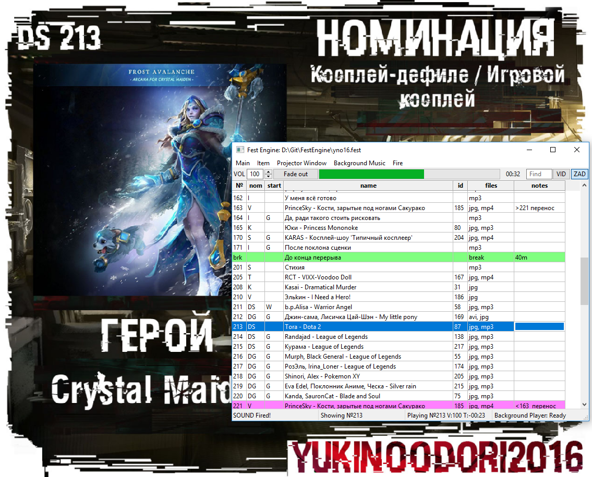

Сидел я однажды на региональном Аниме-фесте, смотрел как на проекторе мышкой таскают файлы и осознал что хватит это терпеть!

Миру нужна система, через которую можно одновременно показывать картинку на проекторе (задник), включать аудио и при необходимости включать видео вместо картинки.

На одном компьютере.

В одном приложении.

Приехал домой и начал писать **Fest Engine**. Давно хотел что-нибудь полезное назвать **Fest Engine**. Вроде норм звучит.

## Как было раньше у меня:

- AIMP для аудио на первом компе/операторе без проектора.
- Cosplay2 Timer для обратного отсчета на втором компе, который на проекторе.
- FastStone для задников на втором компе/операторе.
- Картинка феста на рабочем столе, скрытая панель задач. Копия картинки феста в FastStone, чтобы включать ее не сворачивая FastStone
- VLC для видео хитро настроенный автоматически разворачиваться на втором мониторе (обязательно нужно его закрыть на втором мониторе чтобы он именно там в следующий раз открылся при открытии файла) .
- При открытии файла из папки, чтобы добраться до которой надо убрать фокус с FastStone.

Как это в других лучше не знать... Мало кто отключает системные звуки даже, а мышка бегающая по экране проектора и интерфейсы винды -- это в порядке вещей.

# Как это теперь:




## Как это работает?

- Разворачиваемся по инструкии ниже.
- Создаём скрипт запуска на основе [Start-Sample-Fest.bat](Start-Sample-Fest.bat). Регулярное выражение `filename_re` должно покрывать название файла до точки расширения.
   В нём обязательно должна быть как минимум одна именованная группа -- группа `num`. Это уникальный номер заявки по программе, по нему будет проиводиться сортировка номеров и его должны знать ваши участники.
   Я использую трехзначные чётные числа в которых сотни обозначают номер блока. Только чётные, чтобы всегда было место куда вставить что-нибудь нечётное между номерами.
   В самом простом виде регулярное выражение для описанной нумерации выглядит так: `^(?P<num>\d{3}) (?P<filename>.*)`. Если у вас есть чёткая структура имён файлов, вы легко её распарсите в столбцы таблицы (да, имена остальных именованных групп образуют столбцы таблицы).
- Запускаем FestEngine и тестируем что всё работает. Проверяем что все файлы на месте и воспроизводятся, если нужно, перекодируем.
- Приходим на фест (с тем же ноутом).
- Указываем какой из мониторов -- проектор.

    

- Выбираем нужную строчку, ждём объявления участника, топим **F1** -- Задник на проектор пошёл.
- Выходит участник, топим **F2** -- Звук пошёл. Если видео а не звук, то видео тоже пошло вместо задника.
- Уходит участник -- жмём **Shift+F1** чтобы убрать задник.
- Повторяем пока есть участники.
- Профит, все любят ваш фест! Только не забудьте отслушать все материалы на предмет низкого битрейта и отсмотреть все видосы **именно на том компе который будет на фесте**. 

# На чём это зиждется?

- **Python 2** -- самый простой язык в мире, в коде разберётся даже школоло
- **wxPython 3** -- мощнее чем tcl/tk и более пайтонично чем Qt (ну не люблю я Qt)
- **VLC Python bindings** -- оказывается можно показывать видео через VLC не запуская VLC (но устанвоить всё-таки надо)

Соответственно: Linux, Windows и MacOS нативно поддерживаются сразу из коробки (самом деле нет, надо [получше потестить](https://github.com/Himura2la/FestEngine/issues/16), сейчас гарантирвоано поддерживается только венда и вроде как Debian-based линуксы)

# Какие ещё киллер-фичи?

- [#4](https://github.com/Himura2la/FestEngine/issues/4): Если в поле комента вписать какой-нибудь ID (например `">183 maybe"`), строчка сдублируется в нужном месте. Это удобно если участника паренесли и надо не забыть об этом. Такие строки можно удалять и обновлять комент в них изменяя комент в исходной.
- [#2](https://github.com/Himura2la/FestEngine/issues/2): Офигительный поиск. Самый минималистичный, быстрый и удобный из возможных. Есть только одно текстовое поле -- туда можно вводить что угодно, по мере ввода таблица фильтруется. Выбираем что нужно в отфильтрованной, кликаем правой кнопкой по полю поиска и переходим в полную таблицу! Чтобы не забыть выйти из фильтра, фон отфильтрованной таблицы меняет цвет.  
- [#7](https://github.com/Himura2la/FestEngine/issues/7): Фоновая музыка на интермедии и удобный плеер к ней. Можно запускать и паузить одной кнопкой, а можно открыть полноценный плеер. В плеере можно включать конкретную композицию, смотреть какие отыграли а какие были скипануты, можно переходить к нужному времени в треке, есть Fade In/Out, [в планах Crossfade](https://github.com/Himura2la/FestEngine/issues/28).
- [#29](https://github.com/Himura2la/FestEngine/issues/29): Можно сделать резервный трек без видео для тех у кого видео.
- [#26](https://github.com/Himura2la/FestEngine/issues/26): Можно заменить трек или задник участника, особенно полезно для тех кто заменяет трек на репетиции. Но не забудьте заменить трек во всех резервных копиях или следить за тем [откуда воспроизвоядся файлы](https://github.com/Himura2la/FestEngine/issues/34)

# [В планах](https://github.com/Himura2la/FestEngine/issues)

Если ты чувствуешь в себе силу что-нибудь из этого запилить, будешь няшкой и сделаешь звук на фестах чуть лучше!


# Как это поднять?

## Windows

- Выбрать разрядность (x32 или x64) и придерживаться этой разрядности во всех дальнейших установках
- Установить последний [Python 2.7](https://www.python.org/downloads/windows/) выбранной разядности. При установке отметить чекбокс **Добавить python.exe в PATH** (если это единственный Python, который у вас будет).
- Установить последний [wxPython 3 для Python 2.7](https://sourceforge.net/projects/wxpython/files/wxPython/) выбранной разядности (wxPython 4 Phoneix не пойдёт, нужна именно версия 3, они сломали обратную совместимость, запланирвоан перевод в [#37](https://github.com/Himura2la/FestEngine/issues/37))
- Установить последний [VLC](https://www.videolan.org/vlc/index.ru.html) **выбранной разядности** (если у вас ничего не запускается, проверьте разрядность VLC. Это common issue.)
- Установить [Git](https://git-scm.com/), [SourceTree](https://www.sourcetreeapp.com/) или [GitHub](https://desktop.github.com/) и научиться клонировать репозитории
- Если вы установили чистый git, то клонируйте рекурсивно, чтобы [python-vlc](https://github.com/oaubert/python-vlc/) тоже прилетел: `git clone --recursive https://github.com/Himura2la/FestEngine.git`
- Обновить **setuptools**: `pip install --upgrade setuptools`
- Установить [VLC Python Bindings](https://wiki.videolan.org/python_bindings) (библиотека для управления плеером VLC): Из папки **python-vlc** выполнить `python setup.py install`
- Можно запускать Fest Engine: Из папки **src** выполнить `python main.py`
- Качнуть [тестовые данные](https://drive.google.com/file/d/0B4v9WFUhaeVvRmdXcXNaRHB0THc/view), отредактировать пути в [Debug-tulafest16.bat](https://github.com/Himura2la/FestEngine/blob/master/Debug-tulafest16.bat) и запустить Fest Endine с данными.
- Писать код в [PyCharm](https://www.jetbrains.com/pycharm/) и отправлять Pull-Request'ы

## Debian-based

```sh
sudo apt install git python2.7-dev python-wxgtk3.0-dev vlc -y
git clone --recursive https://github.com/Himura2la/FestEngine.git
cd python-vlc
sudo python setup.py install
cd ..
python main.py # pass arguments to configure your paths
```

# Кто это использует?

С помощью Fest Engine проводились следующие мероприятия:

* [Hokori Tori 2017](https://vk.com/hokori_tori), Орёл
* [СROSSxOVER - 2017](https://vk.com/crossover_42), Кемерово
